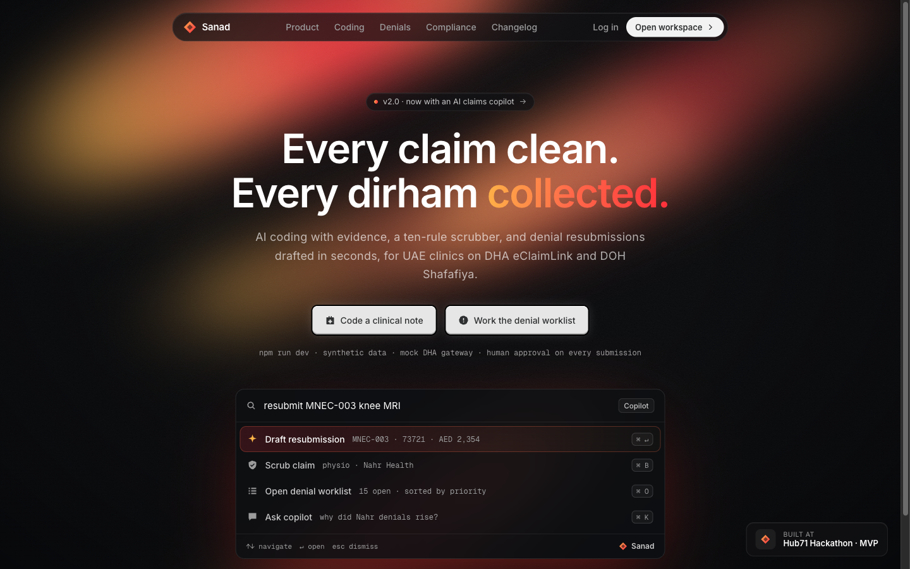
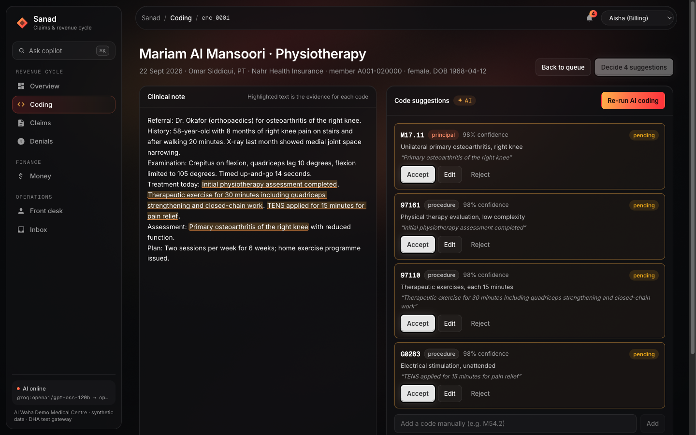
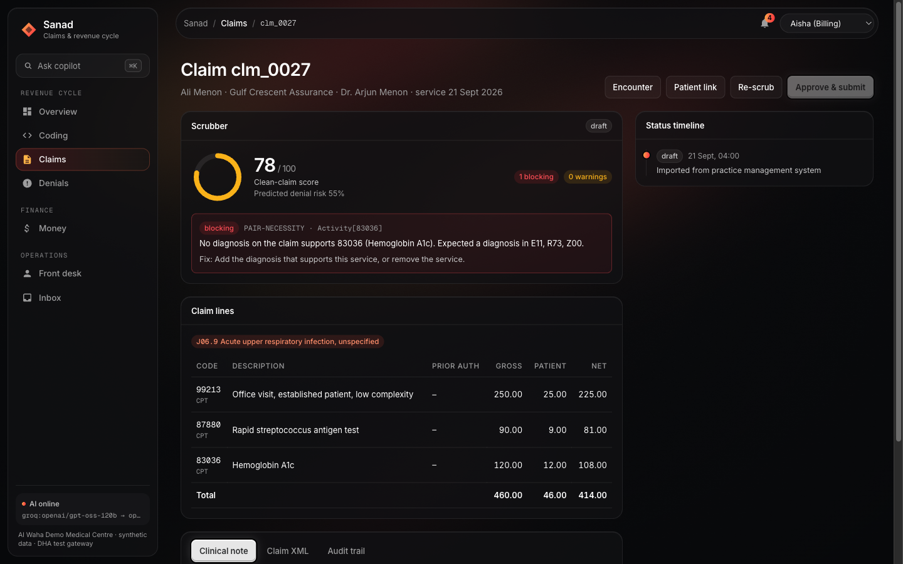
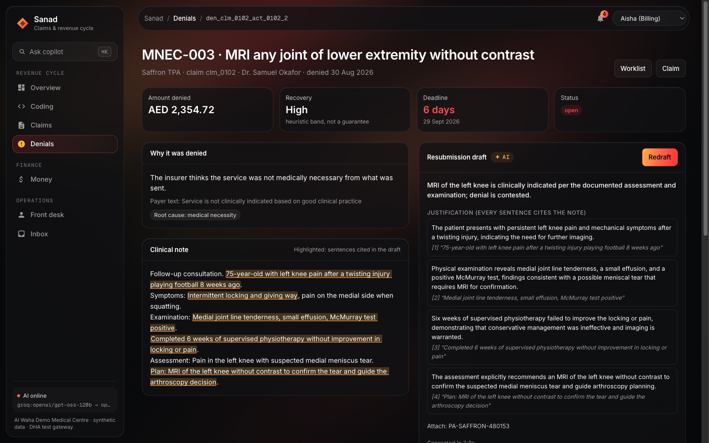
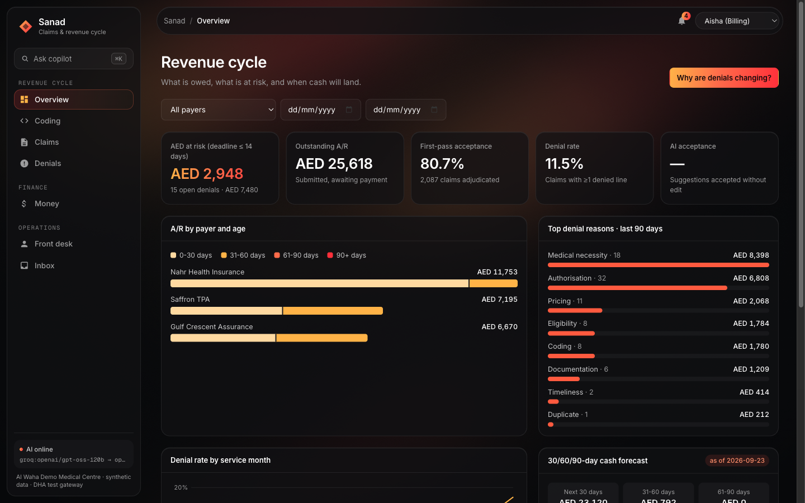
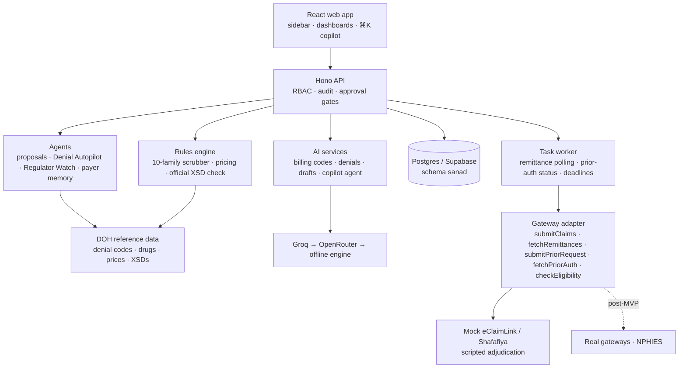

<div align="center">

# Sanad

**AI claims and revenue-cycle co-pilot for UAE clinics.**

Reads the doctor's note, fills in the billing codes the insurer needs, checks the claim against the regulator's own rules, submits it through a DHA/DOH gateway adapter, reconciles the payment, and drives every denial to an appeal that quotes the note. AI drafts; rules decide; a named person approves everything that leaves the clinic.

*Sanad* (سند) is Arabic for "support" and "supporting document": the evidence behind every claim.

</div>



> **Hackathon MVP. Synthetic patients only.** Regulator reference data is real: the official DOH Abu Dhabi denial codes, drug list with regulated prices, drug reference prices and e-claim XSDs, imported from the public Shafafiya dictionary (`npm run import-ref`). Payers, contracts and patients are fictional, and the gateway is a spec-faithful mock of DHA eClaimLink / DOH Shafafiya. Do not load real patient data.

## Why Sanad

### The problem

UAE private clinics are paid mostly by insurers, through the DHA eClaimLink (Dubai) and DOH Shafafiya (Abu Dhabi) portals. Getting paid is a manual chain: read the doctor's note, pick the codes, check the payer's rules and contract prices, build the claim file, submit, then chase whatever comes back denied or underpaid. Each hand-off leaks money:

- **Claims are rejected for fixable reasons.** A missing prior approval, a code with no supporting note, or a price above contract means a denial, weeks of delay and rework.
- **Denials are worked late or never.** They arrive as cryptic insurer payment files, pile up in no particular order, and quietly expire past the resubmission window.
- **Underpayments go unnoticed.** Nobody checks every paid line against the contract price.
- **Cash is hard to predict.** Finance can't see what is stuck, with which payer, or what will land this month.

### For whom

Small and mid-sized outpatient clinics and polyclinics in Dubai and Abu Dhabi that bill insurers directly and have no large revenue-cycle team. Sanad gives each person on that team a job-specific view:

| Who | What Sanad does for them |
| --- | --- |
| **Claims coder** (medical coder) | Suggests the billing codes (diagnosis and treatment) and shows the sentence in the note behind each one. |
| **Biller** | Scrubs the claim before it goes out, sees how each insurer usually treats a service, ranks the denials to work first, and approves appeals that Denial Autopilot has already drafted. |
| **Doctor** | Gets a one-click query only when the note is missing something the payer needs. |
| **Finance / owner** | Sees reconciliation, underpayments, AED at risk and a 30/60/90-day cash forecast. |
| **Front desk** | Checks eligibility, handles prior approvals and gives a cost estimate before the visit. |
| **Patient** | Gets a plain-language bill page, and can photograph any bill to have it explained. |

### The measurable outcome

The goal: **every claim clean the first time, every denial worked within 48 hours, every dirham owed collected and forecast.** Sanad tracks the numbers behind that on its own dashboard, so a pilot clinic can compare them against its baseline from before Sanad:

| Outcome | Metric (shown in Sanad) | Direction |
| --- | --- | --- |
| Fewer avoidable rejections | First-pass acceptance rate; denial rate by payer, doctor and code | ↑ first-pass, ↓ denials |
| Faster denial recovery | Time from denial to resubmission; share worked within 48 h; denials expired unworked | ↓ time, target 48 h, ↓ expired |
| Money not left on the table | AED recovered from resubmissions; underpaid AED flagged against contract | ↑ recovered |
| Faster cash | Days in A/R and A/R by payer and age; forecast vs actual collections | ↓ days, forecast within a stated band |
| Less manual work | Time to code each visit; share of AI codes accepted without edit | ↓ time, ↑ acceptance |

**What the MVP already proves** on synthetic data (details in [Evaluation](#evaluation)): the right principal diagnosis on 18/20 gold notes, 30/30 seeded claim errors caught before submission with 0 false flags, 15/15 denials classified, resubmission drafts in under 2 s, and 95/95 remittance lines reconciled with 5/5 underpayments caught.

## What it does

| Journey | What happens |
| --- | --- |
| **J1 · Doctor's note → clean claim** | Notes arrive as text, PDF, a photo or scan, or a FHIR push; scans are read by a vision-model OCR chain. AI suggests the billing codes: ICD-10-CM diagnoses, CPT/HCPCS treatments and official DOH drug codes. Each code highlights the sentence that supports it and carries a confidence score. Missing detail (which side, diabetes type, how long conservative therapy was tried) becomes a one-click doctor query. The scrubber runs 10 rule families (including the regulated drug price limit) and returns a Clean-Claim Score with one-click fixes. Claim XML is generated and validated against the **official DOH ClaimSubmission schema**, then submitted behind an approval gate. |
| **J2 · Eligibility and prior auth** | Eligibility check by member ID or Emirates ID. Auth-required detection per payer. AI-drafted clinical justification sent as a `Prior.Request`; status is tracked automatically. |
| **J3 · Denial → resubmission** | Remittance advice is parsed and each denied line is classified: a lookup table first, AI only for free-text payer comments. The worklist is ranked by **amount × recovery probability × deadline urgency**. AI drafts field fixes and a justification in which **every sentence cites the note**; sentences without a verifiable quote are blocked. Resubmit as a correction or internal complaint, or write off with a mandatory reason. |
| **J4 · Reconciliation** | Every remittance line is auto-matched to its claim and activity. Underpayments against the contract price are flagged. Excel export has Paid, Denied and Variance tabs. |
| **J5 · Cash and insights** | A/R by payer and age, first-pass rate, denial rate by payer, doctor and code, AED at risk, a 30/60/90-day forecast with its assumptions shown, and financing readiness. The ⌘K copilot answers money questions as **read-only, tenant-scoped SQL you can inspect**, and handles tasks too (see J7). |
| **J6 · Patient transparency** | Cost estimate from plan benefits, an expiring, no-login, plain-language bill page (first name only), and a public **bill explainer**: a patient photographs any bill and gets each line, any denial code and the questions to ask their insurer in plain language (rate-limited, no login). |
| **J7 · Agents that act, people who approve** | **Denial Autopilot** drafts a cited appeal for every open denial in the background and queues each one as a **proposal**; nothing is sent until a biller approves that exact content (hash-checked, audited). The ⌘K copilot routes questions to tools (data questions, denial-code explanations, claim checks, worklist, drafting appeals) and answers with cards. **Regulator Watch** re-checks the DOH lists daily, reloads changed rules in place and reports which open claims they affect. **Payer memory** learns from adjudicated claims which services each insurer denies well above its usual rate, and why, and shows it on the claim before submission. |

| Billing codes with the reason shown | Scrubber with one-click fixes |
| --- | --- |
|  |  |

| Denial draft citing the note | Revenue dashboard |
| --- | --- |
|  |  |

## Quick start

Requirements: Node 22+.

```sh
npm install
cp .env.example .env   # works as-is: embedded Postgres + offline AI engine
npm run build          # build the web app once
npm run dev            # API on :8788 and web on :5173 (hot reload)
```

Open <http://localhost:5173> (dev) or <http://localhost:8788> (built app served by the API). The first boot seeds the synthetic dataset automatically.

Sign in by picking a demo account (Aisha Billing, Rahul Claims coder, Dr. Fatima, Omar Finance, Noor Front desk, Admin). Press **⌘K** anywhere for the copilot.

### Five-minute demo

1. **Admin** → **Reset demo data** (sidebar). Then **Denials** → **Fetch payer remittances**: 15 open denials arrive, each with its official DOH code and wording.
2. **Notes → Codes** → open a note → **Suggest billing codes**: each code highlights the sentence behind it.
3. **Claims** → open a draft Nahr physiotherapy claim: the scrubber issues plus *What this insurer usually does* (Nahr denies this service about 2× its usual rate, mostly for missing approval).
4. **Overview** (as Aisha or Admin) → **Denial Autopilot** → **Draft appeals for all**. Then **Inbox** → *Waiting for your approval* → **Approve & send** one and **Decline** another. Both show up in **Audit**.
5. **⌘K**: "What does MNEC-003 mean?", "Which denials should I work first?", "Which payer underpays us most?".
6. **Overview** → **Regulator rules** → **Check now** (Admin): re-downloads the DOH lists and reports changes.
7. Landing page → **Explain a bill photo →**: upload any medical bill.

### Configuration

| Variable | Purpose |
| --- | --- |
| `DATABASE_URL` | Postgres URL (e.g. Supabase). Unset = embedded PGlite in `DATA_DIR`. Sanad creates its own `sanad` schema, which Supabase's REST Data API does not expose; TLS is used automatically for remote hosts. On IPv4-only networks use Supabase's **Session pooler** URI. URL-encode special characters in the password (`#` → `%23`). |
| `AI_MODE` | `sample` (offline, deterministic) or `model` (live providers). |
| `LLM_PROVIDERS` | Provider chain tried in order, default `groq,openrouter` (`anthropic` also supported). Any failure falls through to the next provider, then to the offline engine, so the demo never dead-ends. |
| `GROQ_API_KEY`, `GROQ_MODEL` | Groq (default `openai/gpt-oss-120b`, JSON mode). |
| `OPENROUTER_API_KEY`, `OPENROUTER_MODEL`, `OPENROUTER_PROVIDER_ORDER` | OpenRouter fallback (e.g. `minimax/minimax-m3` with provider order `GMICloud`). |
| `GROQ_VISION_MODELS`, `OPENROUTER_VISION_MODELS` | OCR chain for scanned notes, tried model by model in provider order. Defaults: Groq `qwen/qwen3.8-27b`, then OpenRouter `google/gemma-4-31b-it:free` and `google/gemma-4-26b-a4b-it:free`. A 429/5xx gets one short retry before falling through. PDFs with a text layer are read in the browser with no AI. |
| `SANAD_ENCRYPTION_KEY` | 32 random bytes, base64, for AES-256-GCM of Emirates IDs. Required in production. |
| `SANAD_ACCESS_KEY` | Optional shared bearer key in front of the API. |
| `GATEWAY_URL` | Point the adapter at a real gateway proxy. Unset = in-process mock gateway. |
| `ADJUDICATION_DELAY_SECONDS`, `UNDERPAYMENT_THRESHOLD_AED` | Mock payer timing and the reconciliation variance threshold. |
| `TASK_WORKER_ENABLED`, `REGULATOR_WATCH` | Background worker (remittance polling, deadlines, proposal clean-up) and the daily DOH list check; set `false` / `off` to disable. |


`npm run reset-demo` (or **Reset demo data** as Admin) restores the seeded state in about 20 seconds on Supabase.

## Evaluation

`npm run eval` runs the PRD evaluation against a throwaway in-memory database. Latest run on the live chain (Groq `openai/gpt-oss-120b`):

| Criterion | Result | Target |
| --- | --- | --- |
| Correct principal ICD-10 on 20 gold notes | **18/20 (90%)** | ≥ 80% |
| Procedure code precision / recall | 98% / 91% | report |
| Every code shows verbatim evidence | yes | yes |
| Seeded scrubber errors caught | **30/30** | ≥ 90% |
| False flags on clean controls | **0/10** | ≤ 10% |
| Seeded denials classified | **15/15** | 100% |
| Slowest resubmission draft | 1.9 s | < 20 s |
| Remittance lines auto-matched | 95/95 | 100% |
| Seeded underpayments flagged | 5/5 | 5/5 |

The offline engine also clears every target (19/20 principal; its one miss is a note that doesn't state the diabetes type, which correctly raises a doctor query instead). `npm test` runs 24 end-to-end and guardrail tests offline, including the real DOH data, official-schema validation, autopilot-to-approval, copilot tools, payer memory and Regulator Watch.

> The free Groq tier allows 8,000 tokens per minute, and bulk drafting will hit it. Sanad then falls through to OpenRouter and the offline engine, and caches every model response, so a rehearsed demo replays even without network.

## Moat

| Layer | What Sanad has | Why it compounds |
| --- | --- | --- |
| Regulator truth | Official DOH denial codes (57 active), 21,056 drugs with regulated prices, 4,275 reference prices and the official ClaimSubmission / RemittanceAdvice / PriorRequest XSDs, validated structurally (order, cardinality, enumerations, formats) | Rules come from the regulator's own files, re-checked daily; a claim that passes here matches the official format |
| Payer memory | Denial rate and top reason per insurer × service, learned from every remittance | Each clinic's history makes the next claim cleaner; a new competitor starts with none |
| Approval-gated agents | Autopilot, copilot and proposals with content hashes and a hash-chained audit trail | Automation a compliance officer can sign off on |

DHA's eClaimLink code lists (Dubai Drug Codes, DHA denial codes, clinician and facility registers) need a registered eClaimLink account; the import is built so those can be added as further sources once credentials exist. Dubai Pulse publishes DHA facility and professional registers through a keyed API for licence checks.

## Architecture



```
server/src/
  ai/           coding.ts (billing codes) · denials.ts · copilot.ts (SQL) · copilot-agent.ts (tool routing) · priorauth.ts · ocr.ts · llm.ts (provider chain + cache)
  rules/        scrubber.ts (10 families) · pricing.ts (contract prices, co-pay)
  xml/          Claim.Submission / Resubmission / Prior.Request builders, Remittance.Advice parser, pinned schema, xsd-check.ts (official XSDs)
  gateway/      adapter.ts (interface + HTTP) · mock-gateway.ts (scripted payer)
  services/     platform.ts (workflows) · analytics.ts (dashboard, reconciliation, forecast, xlsx) · audit.ts
                proposals.ts · denial-autopilot.ts · regulator-watch.ts · payer-intel.ts
  data/         codeset.ts · reference.ts (payers, denial codes) · notes.ts (20-note gold set)
                ref-import.ts + xlsx.ts (DOH downloads) · ref-data.ts (loaded snapshots) · ref/ (committed snapshots + manifest)
  seed.ts       150 patients · 200 encounters · 30 seeded errors · 15 denials · 5 underpayments · 2,000 historical claims
schemas/        claim-submission.dha-v1.json (pinned structural schema)
web/src/        App shell (sidebar + ⌘K), pages/ (incl. agents.tsx: approval queue, Autopilot, rules, copilot cards; explain.tsx: bill explainer), charts.tsx
```

### Built on OpenMuse patterns

Sanad borrows patterns from OpenMuse, the parent repo, and rebuilds them in its own stack. No OpenMuse code or CopilotKit packages are imported.

| OpenMuse pattern | In Sanad |
| --- | --- |
| Hono server layout; zod-validated routes with typed `AppError`s | `server/src/app.ts` |
| `(owner, kind, id, data jsonb)` record store on PGlite or Postgres | `server/src/db.ts`; `owner` is the clinic (tenant) |
| Durable task worker with backoff | `startWorker` in `bootstrap.ts`: remittance polling, prior-auth status, deadlines, proposal clean-up |
| **ActionService** proposals: an outward action is stored with a content hash and runs only when a person approves that exact content | `services/proposals.ts`: appeals wait in the Inbox; approval is refused if the draft changed after review; every decision is audited |
| **Durable task engine**: stored job, lease, progress | `services/denial-autopilot.ts`: Denial Autopilot drafts every open denial into a proposal; a second run never duplicates |
| **Page watches** | `services/regulator-watch.ts`: re-checks the DOH lists daily, reloads changed rules in place, names affected claims |
| **Tool-calling agent with result cards** (`defineTool`, `useRenderTool`) | `ai/copilot-agent.ts` + `AgentCards`: ⌘K picks one of five tools and answers with denial, claim, code or proposal cards |
| **Pause at a proposal** (agent write tools never act directly) | The copilot's "draft appeals" tool only creates proposals, and respects roles |
| **Memory** | `services/payer-intel.ts`: payer memory learned from adjudicated claims (denial rate and top reason per insurer and service) |

Not brought over: the CopilotKit runtime and AG-UI streaming (they don't fit the Groq → OpenRouter → offline chain without a rewrite), the multi-step tool loop (the copilot picks one tool per question), and OpenMuse's browser, email, calendar, PDF-filling and mobile features.

The design follows a warm-aurora dark aesthetic: Inter and Geist Mono, glass surfaces, and keycap primary buttons.

## Security and compliance posture

- **Human approval gate**: claims, resubmissions and prior-auth requests require an explicit `confirm: true` from an authorised role; the approver and timestamp are stored on the record. Anything an agent prepares (Autopilot, copilot) is a **proposal** that runs only when a biller approves that exact content; if it changed after review (content hash mismatch), it is refused.
- **RBAC**: biller, claims coder, doctor, finance, front desk and admin, least privilege (e.g. claims coders cannot submit; doctors see only their own queries).
- **Tenant isolation**: every record is keyed by organization. Copilot SQL runs in a `READ ONLY` transaction against views filtered by a transaction-local tenant setting, and a guard rejects anything but a single `SELECT` over those views.
- **Encryption**: Emirates IDs are AES-256-GCM at rest, masked in every API response and in the XML preview.
- **Audit**: append-only and SHA-256 hash-chained; `GET /api/audit/verify` detects tampering.
- **AI guardrails**: codes are filtered against the loaded code set (inactive or demographically invalid codes never shown); evidence must exist verbatim in the note; unsupported resubmission sentences are blocked; minimal fields are sent to models (no names).
- **Public pages**: the patient bill page and bill explainer need no login; the explainer is rate-limited per visitor, and neither the photo nor the text read from it is stored.
- **Data residency**: Federal Law No. 2 of 2019 generally requires UAE hosting for health data, so a pilot needs UAE-region hosting for both the database and the model before real data. These are planning notes, not legal advice.

## Deviations from the PRD (deliberate, for the build window)

- **Vite + React SPA** instead of Next.js; one Node process serves the API and the built app.
- **Official DOH XSDs** are enforced alongside the pinned structural schema in `schemas/`; for a Dubai (DHA) organisation the header disposition values follow eClaimLink. DHA's own XSD needs an eClaimLink account.
- **MVP identity** via a user picker plus optional shared key; replace with SSO before a pilot.
- **OCR via vision LLMs, not a dedicated OCR engine**: photos and scanned PDFs go to `POST /api/ocr` and the vision-model chain above; the transcript is shown for review before the encounter is saved. Notes can also be pasted, loaded as `.txt`, or pushed as a FHIR `Encounter` (`POST /api/fhir/Encounter`, idempotent on the resource id).

## Known limits

- **Dubai (DHA) lists** (Dubai Drug Codes, DHA denial codes, clinician and facility registers) need a registered eClaimLink account, so the real reference data is Abu Dhabi's (DOH). Payers, contracts, patients and clinicians are synthetic.
- **OCR fallback**: Groq's vision model is verified; the OpenRouter free vision models were rate-limited during testing, so the fallback path is unverified.
- **Payer memory** learns from this clinic's own adjudicated claims; on the demo it runs on seeded history.

## Scripts

| Command | What it does |
| --- | --- |
| `npm run dev` | API (watch) + Vite dev server |
| `npm run build` / `npm start` | Build the web app / serve API and app |
| `npm run reset-demo [-- --release]` | Reseed the demo (optionally land the payer remittance run immediately) |
| `npm run eval` | PRD evaluation metrics |
| `npm run import-ref` | Download and parse the DOH reference lists and XSDs into `server/src/data/ref` |
| `npm run ocr-probe` | Check which vision models in the OCR chain respond |
| `npm test` | Offline end-to-end and guardrail tests |
| `npm run typecheck` | Server and web type checks |

## License

MIT
