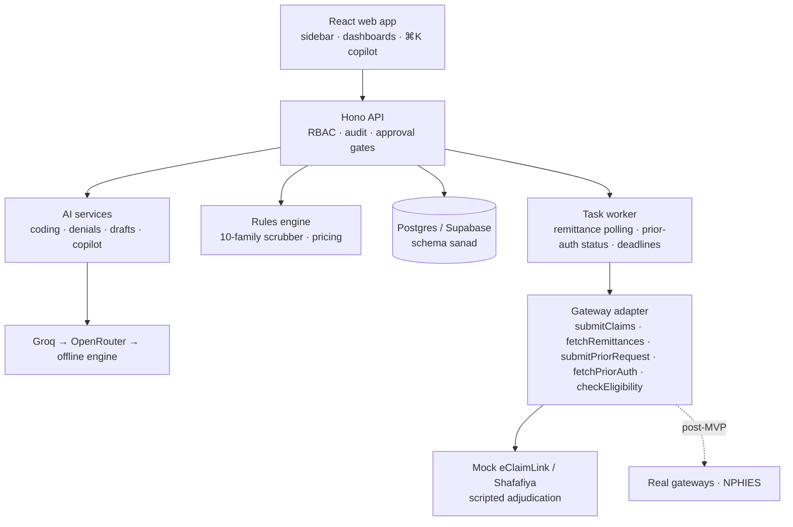

<div align="center">

# Sanad

**AI claims and revenue-cycle co-pilot for UAE clinics.**

Turns a clinical note into a coded, scrubbed, regulator-format claim, submits it through a DHA/DOH gateway adapter, reconciles the remittance, and drives every denial to a cited resubmission. AI drafts; rules decide; a named human approves everything that leaves.

*Sanad* (سند) is Arabic for "support" and "supporting document": the evidence behind every claim.

</div>


> **Hackathon MVP. Synthetic data only.** The gateway is a spec-faithful mock of DHA eClaimLink / DOH Shafafiya. Denial codes, price lists and payers are fictional configuration. Do not load real patient data.

## What it does

| Journey | What happens |
| --- | --- |
| **J1 · Encounter → clean claim** | AI suggests ICD-10-CM and CPT/HCPCS/drug codes. Each code highlights the sentence that supports it and carries a confidence score. Missing specificity (laterality, diabetes type, conservative-therapy duration) becomes a one-click doctor query. The scrubber runs 10 rule families and returns a Clean-Claim Score with one-click fixes. Claim XML is generated and schema-validated, then submitted behind an approval gate. |
| **J2 · Eligibility and prior auth** | Eligibility check by member ID or Emirates ID. Auth-required detection per payer. AI-drafted clinical justification sent as a `Prior.Request`; status is tracked automatically. |
| **J3 · Denial → resubmission** | Remittance advice is parsed and each denied line is classified: a lookup table first, AI only for free-text payer comments. The worklist is ranked by **amount × recovery probability × deadline urgency**. AI drafts field fixes and a justification in which **every sentence cites the note**; sentences without a verifiable quote are blocked. Resubmit as a correction or internal complaint, or write off with a mandatory reason. |
| **J4 · Reconciliation** | Every remittance line is auto-matched to its claim and activity. Underpayments against the contract price are flagged. Excel export has Paid, Denied and Variance tabs. |
| **J5 · Cash and insights** | A/R by payer and age, first-pass rate, denial rate by payer, doctor and code, AED at risk, a 30/60/90-day forecast with its assumptions shown, and financing readiness. The ⌘K copilot answers questions as **read-only, tenant-scoped SQL you can inspect**. |
| **J6 · Patient transparency** | Cost estimate from plan benefits, plus an expiring, no-login, plain-language bill page (first name only). |

| AI coding with evidence | Scrubber with one-click fixes |
| --- | --- |
|  |  |

| Denial draft citing the note | Revenue dashboard |
| --- | --- |
|  |  |

## Quick start

Requirements: Node 22+.

```sh
npm install
cp .env.example .env   # works as-is: embedded Postgres + offline AI engine
npm run build          # build the web app once
npm run dev            # API on :8788 and web on :5173 (hot reload)
```

Open <http://localhost:5173> (dev) or <http://localhost:8788> (built app served by the API). The first boot seeds the synthetic dataset automatically.

Switch roles with the user picker (Aisha Billing, Rahul Coder, Dr. Fatima, Omar Finance, Noor Front desk, Admin). Press **⌘K** anywhere for the copilot.

### Configuration

| Variable | Purpose |
| --- | --- |
| `DATABASE_URL` | Postgres URL (e.g. Supabase). Unset = embedded PGlite in `DATA_DIR`. Sanad creates its own `sanad` schema, which Supabase's REST Data API does not expose; TLS is used automatically for remote hosts. On IPv4-only networks use Supabase's **Session pooler** URI. URL-encode special characters in the password (`#` → `%23`). |
| `AI_MODE` | `sample` (offline, deterministic) or `model` (live providers). |
| `LLM_PROVIDERS` | Provider chain tried in order, default `groq,openrouter` (`anthropic` also supported). Any failure falls through to the next provider, then to the offline engine, so the demo never dead-ends. |
| `GROQ_API_KEY`, `GROQ_MODEL` | Groq (default `openai/gpt-oss-120b`, JSON mode). |
| `OPENROUTER_API_KEY`, `OPENROUTER_MODEL`, `OPENROUTER_PROVIDER_ORDER` | OpenRouter fallback (e.g. `minimax/minimax-m3` with provider order `GMICloud`). |
| `SANAD_ENCRYPTION_KEY` | 32 random bytes, base64, for AES-256-GCM of Emirates IDs. Required in production. |
| `SANAD_ACCESS_KEY` | Optional shared bearer key in front of the API. |
| `GATEWAY_URL` | Point the adapter at a real gateway proxy. Unset = in-process mock gateway. |
| `ADJUDICATION_DELAY_SECONDS`, `UNDERPAYMENT_THRESHOLD_AED` | Mock payer timing and the reconciliation variance threshold. |

## The 5-minute demo

1. **Hook**: *Overview* shows AED at risk, A/R by payer and age, and denial reasons.
2. **Clean claim**: *Coding* → the gold-set physiotherapy note (Mariam Al Mansoori) → **Suggest codes** → accept → **Create claim & scrub**. The scrubber flags a missing prior approval and an over-contract price (score **56**). Apply both fixes (**100**), then **Approve & submit**. The mock gateway acknowledges; the claim is paid a few seconds later.
3. **Denial**: *Denials* → **Fetch payer remittances**. Fifteen denials land, ranked; a high-value knee-MRI medical-necessity denial is first. **Draft with AI** → review cited sentences → **Approve & resubmit**.
4. **Money**: *Money* shows seeded underpayments, then **Export Excel**. ⌘K → "Which payer underpays us most?" → the answer plus the SQL it ran. The 30/60/90 forecast is on *Overview*.
5. **Close**: `npm run eval` for the numbers; *Audit* shows the verified hash chain.

`npm run reset-demo` (or **Reset demo data** as Admin) restores the seeded state in about 20 seconds on Supabase.

## Evaluation

`npm run eval` runs the PRD evaluation against a throwaway in-memory database. Latest run on the live chain (Groq `openai/gpt-oss-120b`):

| Criterion | Result | Target |
| --- | --- | --- |
| Correct principal ICD-10 on 20 gold notes | **18/20 (90%)** | ≥ 80% |
| Procedure code precision / recall | 98% / 91% | report |
| Every code shows verbatim evidence | yes | yes |
| Seeded scrubber errors caught | **30/30** | ≥ 90% |
| False flags on clean controls | **0/10** | ≤ 10% |
| Seeded denials classified | **15/15** | 100% |
| Slowest resubmission draft | 1.9 s | < 20 s |
| Remittance lines auto-matched | 95/95 | 100% |
| Seeded underpayments flagged | 5/5 | 5/5 |

The offline engine also clears every target (19/20 principal; its one miss is a note that doesn't state the diabetes type, which correctly raises a doctor query instead). `npm test` runs 14 end-to-end and guardrail tests offline.

> The free Groq tier allows 8,000 tokens per minute, and bulk drafting will hit it. Sanad then falls through to OpenRouter and the offline engine, and caches every model response, so a rehearsed demo replays even without network.

## Architecture



```
server/src/
  ai/           coding.ts · denials.ts · copilot.ts · priorauth.ts · llm.ts (provider chain + cache)
  rules/        scrubber.ts (10 families) · pricing.ts (contract prices, co-pay)
  xml/          Claim.Submission / Resubmission / Prior.Request builders, Remittance.Advice parser, schema validator
  gateway/      adapter.ts (interface + HTTP) · mock-gateway.ts (scripted payer)
  services/     platform.ts (workflows) · analytics.ts (dashboard, reconciliation, forecast, xlsx) · audit.ts
  data/         codeset.ts · reference.ts (payers, denial codes) · notes.ts (20-note gold set)
  seed.ts       150 patients · 200 encounters · 30 seeded errors · 15 denials · 5 underpayments · 2,000 historical claims
schemas/        claim-submission.dha-v1.json (pinned structural schema)
web/src/        App shell (sidebar + ⌘K), pages/, charts.tsx
```

### Built on OpenMuse patterns

Sanad reuses ideas from OpenMuse, the parent repo: the Hono server layout, the `(owner, kind, id, data jsonb)` record store on PGlite or Postgres (here `owner` is the tenant), zod-validated routes with typed `AppError`s, and a durable task worker with backoff. The design follows a warm-aurora dark aesthetic: Inter and Geist Mono, glass surfaces, and keycap primary buttons.

## Security and compliance posture

- **Human approval gate**: claims, resubmissions and prior-auth requests require an explicit `confirm: true` from an authorised role; the approver and timestamp are stored on the record.
- **RBAC**: biller, coder, doctor, finance, front desk and admin, least privilege (e.g. coders cannot submit; doctors see only their own queries).
- **Tenant isolation**: every record is keyed by organization. Copilot SQL runs in a `READ ONLY` transaction against views filtered by a transaction-local tenant setting, and a guard rejects anything but a single `SELECT` over those views.
- **Encryption**: Emirates IDs are AES-256-GCM at rest, masked in every API response and in the XML preview.
- **Audit**: append-only and SHA-256 hash-chained; `GET /api/audit/verify` detects tampering.
- **AI guardrails**: codes are filtered against the loaded code set (inactive or demographically invalid codes never shown); evidence must exist verbatim in the note; unsupported resubmission sentences are blocked; minimal fields are sent to models (no names).
- **Data residency**: Federal Law No. 2 of 2019 generally requires UAE hosting for health data, so a pilot needs UAE-region hosting for both the database and the model before real data. These are planning notes, not legal advice.

## Deviations from the PRD (deliberate, for the build window)

- **Vite + React SPA** instead of Next.js; one Node process serves the API and the built app.
- **Structural JSON schema** in `schemas/` instead of the official XSD. Swap in the published DHA/DOH XSD before a pilot.
- **MVP identity** via a user picker plus optional shared key; replace with SSO before a pilot.
- **No OCR**: text notes, `.txt` upload and FHIR `Encounter` push (`POST /api/fhir/Encounter`, idempotent on the resource id).

## Scripts

| Command | What it does |
| --- | --- |
| `npm run dev` | API (watch) + Vite dev server |
| `npm run build` / `npm start` | Build the web app / serve API and app |
| `npm run reset-demo [-- --release]` | Reseed the demo (optionally land the payer remittance run immediately) |
| `npm run eval` | PRD evaluation metrics |
| `npm test` | Offline end-to-end and guardrail tests |
| `npm run typecheck` | Server and web type checks |

## License

MIT
